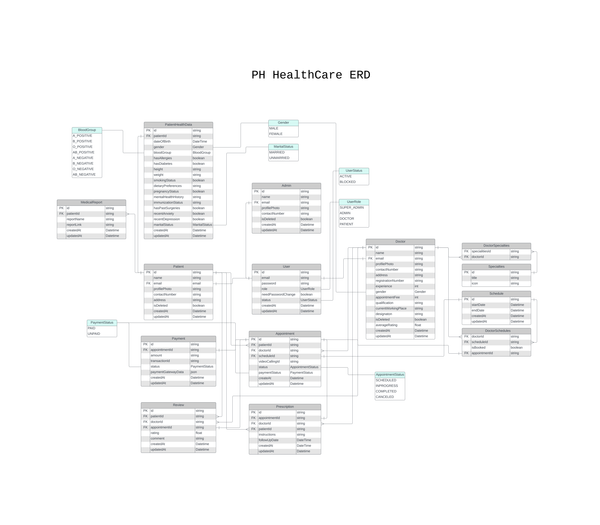

# PH Healthcare Backend

## Project Overview

This project is a comprehensive healthcare management system designed to streamline communication and appointment processes between patients, doctors, and administrators. The system incorporates cuing-edge technologies such as
NodeJS, Express, Prisma, and PostgreSQL for ecient and secure data management.

## Features

- **User Authentication**: Securely authenticate and authorize users for access to the platform.
- **Admin Dashboard**:
  - Manage doctor accounts, including creation and profile updates.
  - Oversee appointment schedules, including slot management and status updates.
  - Access comprehensive metadata and appointment history.
- **Doctor Portal**:
  - View and manage upcoming appointments.
  - Access detailed patient profiles, including medical history and diagnostic test reports.
  - Generate and email prescriptions with additional medical notes.
- **Patient Portal**:

  - Register and manage user accounts with robust account security features.
  - Book and manage appointments, selecting preferred doctors and time slots.
  - Maintain and update medical records, including diagnostic reports.
  - Access prescriptions online and via email for convenience.

- **Integrated Payment System**:
  - Securely handle consultation fee payments during appointment booking.
  - Automate appointment confirmation upon payment, with email notifications for receipts.
- **Feedback System**: Allow patients to review and rate doctors, with a comment section for feedback.
- **Automated Email Notifications**: Notify users about appointment confirmations, invoices, and prescription details.

## Technology Stack

- **Backend**: Node.js, Express.js
- **Database**: PostgreSQL, Prisma
- **Validation**: Zod
- **Authentication**: JWT
- **Other**: TypeScript, ES6+

## ER Diagram



## Setting Up and Using the Application

### Prerequisites

- Node.js (>=14.x)
- npm or yarn
- MongoDB

### Installation

1. **Clone the repository**:

   ```sh
   https://github.com/yasin-arafat-389/PH-HealthCare-Backend
   ```

2. **Install dependencies**:

   ```sh
   npm install
   ```

3. **Set up environment variables**:
   Create a `.env` file in the root directory and add the following variables:

   ```
   NODE_ENV= development
   PORT= 5000
   DATABASE_URL= your database URI
   JWT_SECRET= your jwt secret
   EXPIRES_IN= jwt token expiration time
   REFRESH_TOKEN_SECRET= your jwt refresh token secret
   REFRESH_TOKEN_EXPIRES_IN= jwt refresh token expiration time
   RESET_PASS_TOKEN= reset password token
   RESET_PASS_TOKEN_EXPIRES_IN= reset password token expiration time
   RESET_PASS_LINK= reset password link
   EMAIL= email to use for smtp
   APP_PASS= app password from gmail
   CLOUDINARY_CLOUD_NAME= cloudinary cloud name for image upload
   CLOUDINARY_API_KEY= cloudinary API key
   CLOUDINARY_API_SECRET= cloudinary API secret
   STORE_ID= SSLCOMMERZ store id
   STORE_PASS= SSLCOMMERZ store password
   SSL_PAYMENT_API= SSLCOMMERZ payment API
   SSL_VALIDATIOIN_API= SSLCOMMERZ validation API
   SUCCESS_URL= url to redirect if payment is successful
   CANCEL_URL= url to redirect if payment is cancelled
   FAIL_URL= url to redirect if payment is failed

   ```

4. **Run the application**:
   ```sh
   npm run start:dev
   ```

### Usage

Once the server is running, you can use the following endpoints:

### API Documentation: [Postman API Documentation (Click Here)](https://documenter.getpostman.com/view/34973131/2sAYHwKkD6)
